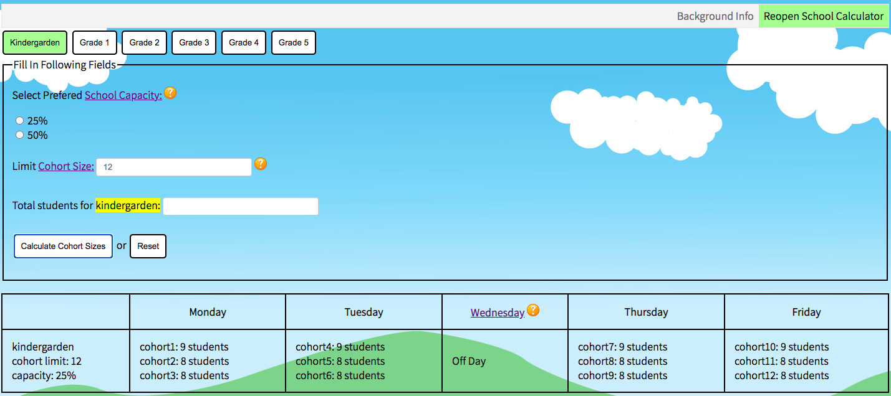

# School Reopening Calculator

### About

* An application for school administrators to gauge cohorts needed per week, students per cohort etc.

### Screenshot

### Features

* Form to fill out information regarding class and cohort sizes
* 5 day schedule showing a hybrid reopening school model
* Background information page featuring information about the school reopening process
